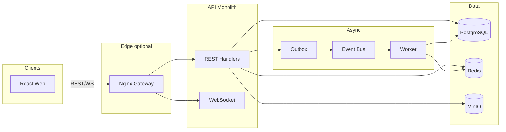

# EchoLine 架构设计

## 定位

EchoLine 是 Telegram-like messaging platform，用于学习真实互联网消息平台的核心工程问题。系统优先采用模块化单体，避免过早微服务化；通过明确模块边界、事件接口、缓存接口和 worker 入口，为后续演进保留空间。

## 高层架构

```text
Client
  | REST / WebSocket
API Server
  |-- auth
  |-- user/device
  |-- conversation
  |-- message
  |-- realtime
  |-- delivery
  |-- presence
  |-- channel
  |-- media
  |-- search
  |-- audit
  |-- rate_limit
  |-- observability
  |
PostgreSQL     Redis       Event Bus       Object Storage       Search
  |              |             |                 |                 |
source of truth cache/presence async workers   media files       message index
```

### 运行时视图（Mermaid）



## 核心链路

### 发送消息

1. 客户端调用 REST 或 WS send。
2. 服务端校验 auth、会话成员关系和限流。
3. 使用 `client_msg_id` 做幂等。
4. 在 conversation 内分配递增 `seq`。
5. 消息持久化到 PostgreSQL。
6. 发布 `message.created` 事件。
7. WebSocket 在线推送。
8. 离线用户后续通过 sync endpoint 补拉。

### 接收消息

1. 在线用户通过 WebSocket 接收。
2. 客户端发送 ACK。
3. 服务端更新 delivery/read state。
4. 如果推送失败，客户端可通过历史同步补偿。

### 离线同步

1. 客户端保存每个会话的 `last_read_seq` 或 `sync_cursor`。
2. 重连后请求增量消息。
3. 服务端按 `conversation_id + seq` 查询。
4. 返回消息、会话 summary、未读数。

## 模块边界

| 模块 | 职责 |
|---|---|
| `auth` | 登录、token、鉴权中间件 |
| `user` | 用户资料 |
| `device` | 设备注册与列表 |
| `conversation` | 私聊、群聊、频道（含成员与 RBAC；无独立 `channel` 包） |
| `message` | 消息写入、查询、编辑、撤回 |
| `realtime` | WebSocket 连接、心跳、推送 |
| `delivery` | ACK、delivery 状态机 |
| `sync` | 离线 sync endpoint |
| `presence` | 在线状态、last-seen |
| `media` | 附件预签名与元数据 |
| `search` | 消息全文搜索 |
| `audit` | append-only 审计日志 |
| `rate_limit` | 用户、IP、会话维度限流 |
| `entitlement` | 付费频道访问控制 |
| `payment` | 账本与 settle → grant |
| `admin` | 用户/举报/审计/DLQ 管理 API |
| `ads` | 广告 campaign 与 impression |
| `block` / `pin` / `report` | 拉黑、置顶、举报 |
| `notification` | 应用内通知 |
| `reaction` / `thread` / `forward` | 反应、回复串、转发 |
| `export` / `archive` | 会话导出与归档 |
| `push` | Push token 与 fanout worker |
| `encryption` | E2EE key bundle（demo） |
| `recommendation` | 频道/好友推荐 |
| `graph` | GraphQL facade 原型 |
| `webhook` | 出站 webhook 投递与重试 |
| `outbox` / `eventbus` | 事务 outbox、DLQ、事件总线 |
| `worker` | 搜索索引、fanout push、webhook 重试（`cmd/worker`） |
| `metrics` / `telemetry` | Prometheus 指标、OTel/Sentry stub |
| `risk` | 重复内容 spam 检测 stub |
| `apierror` / `validate` | 统一错误 envelope、输入校验 |

## 异步与 Worker

| Worker | 输入 | 输出 |
|--------|------|------|
| Outbox drainer | outbox 表 | Kafka / memory bus |
| MessageCreatedHandler | message.created | 搜索索引 |
| FanoutWorker | message.created | 离线 push（batch 256） |
| Webhook retry | failed deliveries | 外部 webhook |

Worker 通过 `docker compose --profile app` 与 API 同栈部署。

## 边缘路由

可选 `gateway` profile（nginx）将 `/api/*` 与 `/ws` 代理至 monolith — 见 `deploy/gateway/` 与 ADR 0027。

## 关键取舍

- PostgreSQL 是 source of truth，Redis 只缓存热点数据和 presence。
- 消息先持久化再推送，保证推送失败可补偿。
- MVP 先支持小群写入和在线推送，后续再引入大群 fanout 策略。
- 可靠性优先依赖幂等键、conversation seq、ACK 和离线拉取。

