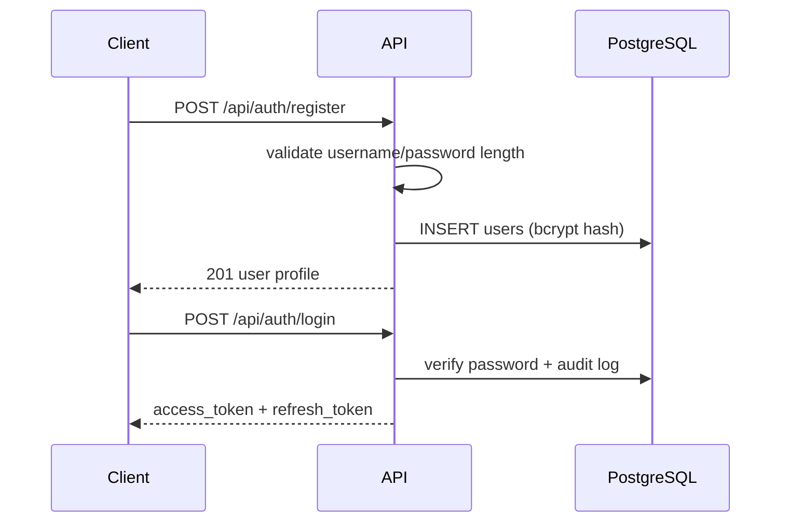
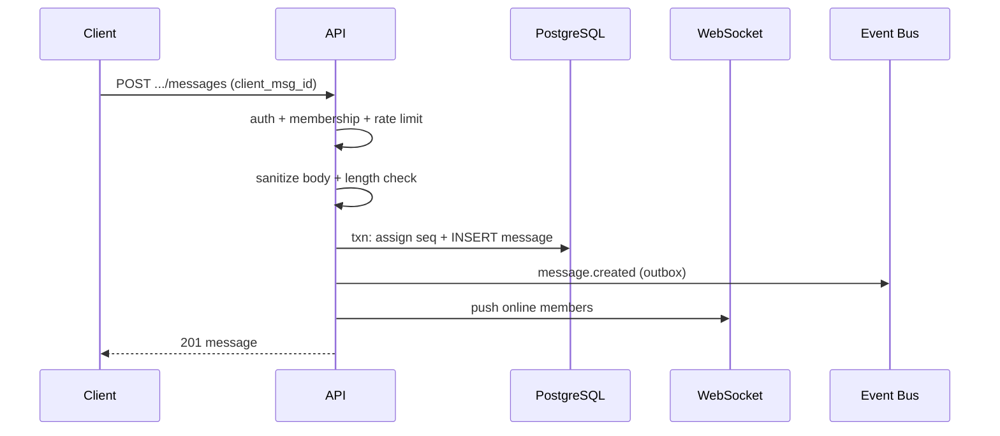
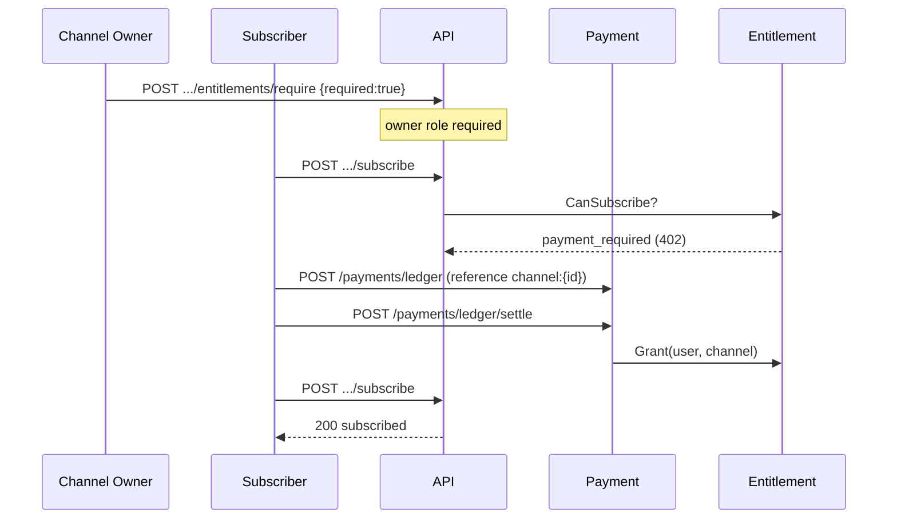

# EchoLine 业务流程

本文档校准核心用户旅程与系统行为，与 `docs/api.md`、`docs/reliability.md`、`docs/data-model.md` 对齐。

## 1. 用户注册与登录

**规则：**

- `username` ≤ 64 字符，`display_name` ≤ 128 字符，密码 ≥ 8 字符（`internal/validate`）。
- 消息 `body` ≤ 65535 字符；发送与编辑均经 sanitize + validate。
- Access token 15 分钟；refresh token 可撤销。
- 登录限流：IP 维度（Redis）。

## 2. 发送消息（持久化优先）

**补偿：** WS 推送失败不影响写入；客户端 sync / 历史分页补拉。

## 3. 付费频道订阅

默认情况下 `POST /api/payments/ledger` 与 `POST /api/payments/ledger/settle` 返回 `403 payment_self_serve_disabled`，防止用户自助绕过付费门控。本地原型可设置 `PAYMENT_SELF_SERVE=true`（见 `docker-compose.yml` api 服务）。

启用 self-serve 时，前端 `ChatPage` 在收到 `402 payment_required` 后自动执行 ledger create → settle → 重试 subscribe。

**授权矩阵：**

| 操作 | 谁可以 |
|------|--------|
| `entitlements/require` | 频道 `owner` |
| `entitlements/grant` | `ADMIN_USER_IDS` 配置的管理员 |
| 支付 settle 自动 grant | **仅** `PAYMENT_SELF_SERVE=true` 时，用户可对本人 `channel:{uuid}` reference settle；生产须 webhook |
| `subscribe` | 任意用户（若需付费则须有效 entitlement） |

## 4. 离线推送 Fanout（Worker）

1. `message.created` 事件进入 worker。
2. `MessageCreatedHandler` 幂等索引搜索（bounded map 10k）。
3. `FanoutWorker` 查询会话成员（排除发送者，batch 256）。
4. `push.Worker` 对离线用户发送通知。

## 5. 管理后台

- `ADMIN_USER_IDS` 环境变量配置管理员 UUID 列表。
- Admin 可查看 users/reports/DLQ；DLQ replay 需 admin。
- 普通用户无法调用 `entitlements/grant`。

## 6. 前端会话流

1. `/login` → token 存入 localStorage + `AuthContext`。
2. `/` → `ChatPage` 拉会话列表；401 时 `authFetch` 自动 refresh。
3. 推荐频道点击 → `subscribeChannel` → 选中会话。
4. `/settings` → 注册 push token / E2EE demo key。

## 验证

- 单元：`go test ./internal/entitlement/... ./internal/validate/...`
- 集成：`RUN_INTEGRATION=1 go test -run Integration ./tests/...`
- E2E：`cd frontend && npm run build && npx playwright test`

## 相关文件

- `backend/internal/entitlement/` — 付费门控
- `backend/internal/payment/handler.go` — settle → grant
- `backend/internal/worker/handlers.go` — fanout + index
- `frontend/src/pages/ChatPage.tsx` — 主聊天流
- `frontend/src/context/AuthContext.tsx` — token refresh
